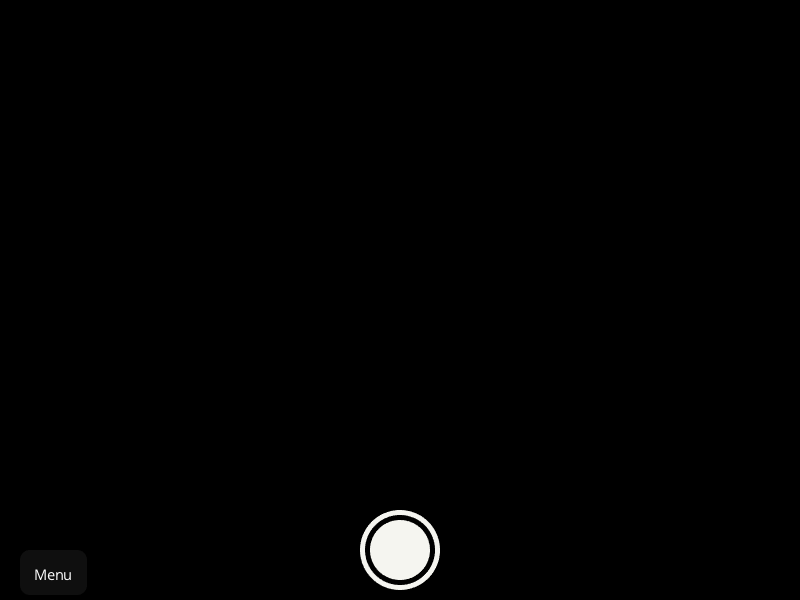

  <h1>Camora</h1>
  <h3> kinda sorta of a TICK TACK TO demo</h3>
  </img>

* yes my wabcam is garbeg , so showing this is much better*

a camera, photo only one, wich is powerd by my tick tack to library

you have some basic configs, like the dim and the pictors location, and the camera number

that is it, have a nice day
